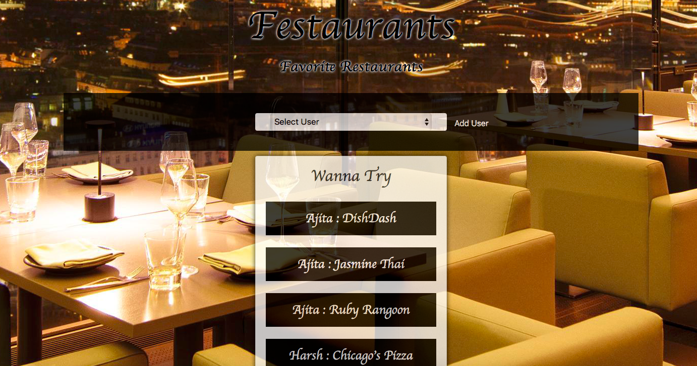

# Restaurants_Sequelize

## About
This is a full-stack web application using MVC architecture and node.js,express,sequelize,handlebars wherein users can keep a track of their favorite restaurants. They can enter the restaurant names they wish to visit. Once they visit, they can either like or dislike the restuarant. At any time, a user can see/edit all his restaurants that are unvisited, liked or disliked by him. Also, he can view the wish list of all users in ascending order of their names and restaurant names.

## Deployed Link
[Restaurants_MVC_Sequelize](https://restaurant-sequelize-mvc.herokuapp.com/)

## Application Preview

### Home page


### Add User


### User's page


## Technologies used
1. Node.js
2. Express
3. Sequelize with MySQL dialect
4. Handlebars

## Node Packages used
1. express
    * usage
    ```require("express")```
    * It is a fast, unopinionated, minimalist web framework for node.
    * For more information: [express](https://expressjs.com)

2. mysql
    * usage
    ```require("mysql")```
    * A node package that is used to connect to mysql server and thus allows us to run queries on database tables; It also aloows us to delete, update or insert into the database tables.
    * For more information: [mysql](https://www.npmjs.com/package/mysql)

3. body-parser
    * usage
    ```require("body-parser")```
    * Node.js body parsing middleware.Parses incoming request bodies in a middleware before handlers, available under the req.body property.
    * For more information: [body-parser](https://www.npmjs.com/package/body-parser)

4. express-handlebars
    * usage
    ```require("express-handlebars")```
    *  lets one build semantic templates effectively. It is logic-less and keeps the views and logic separated.
    * For more information: [express-handlebars](https://www.npmjs.com/package/express-handlebars)

5. sequelize
    * usage
    ```sequelize init:config```
    ```sequelize init:models```
    * It is a promise-based ORM for Node.js. These two command when run on terminal after npm install sequelize create 2 files config.json and index.js. Config.json will provide the configuartion for connecting to database while index.js imports sequelize and creates an object 'db' that is exported. This object contains all the models as a key. When imported on a controller page, these keys can be used to access the models.
    * For more infromation: [sequelize](http://docs.sequelizejs.com)

## Execution steps on local machine
1. Make sure node is installed on your machine. You can visit the website [Node Installation](http://blog.teamtreehouse.com/install-node-js-npm-mac) for instructions.
2. Download/Clone the respository.
3. On terminal, go inside Restaurants_MVC folder and type npm install. This will install all the dependencies required to run the application mentioned in package.json.
4. Make sure mysql is installed on the localhost/other server. 
5. Log into mysql workbench and execute db/schema.sql from the repository. This will create the database on the server.
6. Open config.json and change development.user, development.password with your values.
7. Inside Restaurants_MVC folder on terminal, type "node server.js" on terminal. This will start the server.
8. Open the browser and type "localhost:8080". This will start executing the client part of the application.


## Code snippets

### server
```
var exphbs = require("express-handlebars");
app.engine("handlebars", exphbs({ defaultLayout: "main" }));
app.set("view engine", "handlebars");

require("./routes/api-routes.js")(app);

db.sequelize.sync().then(function() {
  app.listen(PORT, function() {
    console.log("App listening on PORT " + PORT);
  });
});
```
This code snippet shows how to set the handlebars, how server gets the access to the controllers' functionalities and how the server starts listening on the mentioned port.

### models
#### Restaurant

```
var Restaurant = sequelize.define("Restaurant", {
      name: {
          type: DataTypes.STRING,
          allowNull: false
      },
      visited: {
          type: DataTypes.BOOLEAN,
          defaultValue:false
      },
      liked: { 
          type: DataTypes.BOOLEAN,
          defaultValue:false
      }
});
```

#### User
```
var User = sequelize.define("User", {
      username: {
          type: DataTypes.STRING,
          allowNull: false
      }
});
```

### model relationship
```
Restaurant.associate = function (models) {
    models.Restaurant.belongsTo(models.User, {
        foreignKey: {
        allowNull: false
        }
    });
}
```
```
User.associate = function(models) {
    models.User.hasMany(models.Restaurant,{
        onDelete: "cascade"
    });
};
```
User has many restaurant names entries while a restaurant name entry can belong to only one user


### view
```
<body>
	{{{ body }}}
</body>
```
On server.js, we mentioned main.handlebars to be loaded at the start. This has a placeholder {{{body}}} for the main content to be rendered. Other handlebars are rendered based upon the routes in the controller.

```
{{#each restaurants}}
    {{#unless visited}}
        {{> restaurants/unvisited-block}}
    {{/unless}}
{{/each}}
```
This is to extract all the unvisited restaurants for all the users. It renders unvisited-block.handlebars and prints these restaurants in that block in ascending order of user names and then restaurant names.

```
<select name="users" id="user-ddl">
    <option value="0">Select User</option>
    {{#each users}}
        <option value="{{this.id}}">{{this.username}}</option>
    {{/each}}
</select>
```
From the database's response of all users, for each user above code snippet renders the dropdown list with users' names. This is rendered only on the home page.

```
function getAllRestaurants(data){
    $("#unvisited-restaurants").empty();
    $("#unvisited-restaurants").append(`<h2>Wanna Try</h2>`);
    for(var i =0;i<data.restaurants.length;i++){
        if(!data.restaurants[i].visited){
            
            $("#unvisited-restaurants").append(`<br><div class="restaurant-each unvisited">
            <button class="btn liked" data-id=`+data.restaurants[i].id+`><i class="fa fa-thumbs-up"></i></button>`+
            data.restaurants[i].name+
            `<button class="btn disliked" data-id=`+data.restaurants[i].id+`><i class="fa fa-thumbs-down"></i></button>
            </div>`)
        }
    }

    $("#liked-restaurants").empty();
    $("#liked-restaurants").append(`<h1><i class="fa fa-thumbs-up"></i></h1>`);
    for(var i =0;i<data.restaurants.length;i++){
        if(data.restaurants[i].visited && data.restaurants[i].liked){
            
            $("#liked-restaurants").append(`<br>
            <div class="restaurant-each">`+data.restaurants[i].name+`<button class="btn delrestaurant" data-id=`+data.restaurants[i].id+`><i class="fa fa-trash"></i></button>
            </div>`)
        }
    }

    $("#disliked-restaurants").empty();
    $("#disliked-restaurants").append(`<h1><i class="fa fa-thumbs-down"></i></h1>`);
    for(var i =0;i<data.restaurants.length;i++){
        if(data.restaurants[i].visited && !data.restaurants[i].liked){
            
            $("#disliked-restaurants").append(`<br>
            <div class="restaurant-each">`+data.restaurants[i].name+`<button class="btn delrestaurant" data-id=`+data.restaurants[i].id+`><i class="fa fa-trash"></i></button>
            </div>`)
        }
    } 
}
```
This code snippet renders the unvisited, liked and disliked blocks for each user every time a user is selected from the dropdown list.

AJAX REQUESTS FROM CLIENT
```
$("#submit-user").on("click",function(event){
    event.preventDefault();

    var user = $("#user-name").val().trim();
    $("#user-name").val("")

    if(user !==""){

        // Send the POST request with values in request body
        $.ajax("/api/users", {
            type: "POST",
            data:{username:user}
        }).then(
            function() {
            location.reload();
        });
    }
});
```
When new user is added, POST request is sent to the server to create a new user in database.

```
$("#submit-restaurant").on("click",function(event){
    event.preventDefault();

    var user = $("#user-ddl").val();
    var name = $("#restaurant-name").val().trim();
    $("#restaurant-name").val("")

    if(name !== ""){
        // Send the POST request with values in request body
        $.ajax("/api/restaurants", {
            type: "POST",
            data:{name:name,
                userId:user}
        }).then(function() {
            $.get("/restaurants/"+userid, function(data){
                console.log(data)
                $("#liked-restaurants").show();
                $("#disliked-restaurants").show();
                getAllRestaurants(data);
                
            });
        });
    }
});
```
When a new restaurant is added, POST request is sent to the server to create a new restaurant for the selected user in database.

```
$(document).on("click",".delrestaurant", function(){
    var id = $(this).data("id");

    // Send the DELETE request with id in query parameter
    $.ajax("/api/restaurants/"+id, {
    type: "DELETE"
    }).then(function() {
    $.get("/restaurants/"+userid, function(data){
        console.log(data)
        $("#liked-restaurants").show();
        $("#disliked-restaurants").show();
        getAllRestaurants(data);      
    });
    });
});
```
When delete button is clicked for a restaurant, DELETE request is sent to the server to delete the restaurant from the database.

```
$(document).on("click",".disliked" ,function(event) {
    var id = $(this).data("id");

    //create object with new values
    var newRestaurantState = {
        visited: true,
        liked :false
    };

    // Send the PUT request with id in query parameter and values in request body
    $.ajax("/api/restaurants/" + id, {
        type: "PUT",
        data: newRestaurantState
    }).then(
        function() {
            $.get("/restaurants/"+userid, function(data){
                console.log(data)
                $("#liked-restaurants").show();
                $("#disliked-restaurants").show();
                getAllRestaurants(data);      
            });
        }
    );
});
```
When dislike button is clicked for a restaurant, PUT request is sent to the server to update the disliked attribute of the restaurant to true.

```
$(document).on("click",".liked", function(event) {
    var id = $(this).data("id");

    //create object with new values
    var newRestaurantState = {
        visited: true,
        liked :true
    };

    // Send the PUT request with id in query parameter and values in request body
    $.ajax("/api/restaurants/" + id, {
        type: "PUT",
        data: newRestaurantState
    }).then(function() {
        $.get("/restaurants/"+userid, function(data){
            console.log(data)
            $("#liked-restaurants").show();
            $("#disliked-restaurants").show();
            getAllRestaurants(data);       
        });
    });
});
```
When like button is clicked for a restaurant, PUT request is sent to the server to update the liked attribute of the restaurant to true.


### controller
Controller has all the information about the model and it according to the requests renders appropriate view.

```
app.get("/", function(req, res) {
    db.Restaurant.findAll({
      include:[{ model: db.User, attributes: ['username']}],
      order: [[db.User,'username','ASC'],['name']]
    }).then(function(data){
      var hbsObject = {
        restaurants: data
      };
      db.User.findAll({}).then(function(data2){
        hbsObject["users"] = data2;
        res.render("index", hbsObject);
      });
    });
  });
```
Here we are extracting information from database using sequelize findAll() method. We are then sending two pieces of information to the client. First has information of all the restaurants names along with the users who added them. This will be used to render the unvisited block with user names and their unvisited restaurants sorted by user names and the restaurant names.
The second piece of information here is the list of all users which will be used to render the dropdown list of users. It then renders index.handlebars with this data.

```
app.get("/restaurants/:userid", function(req, res) {
  db.Restaurant.findAll({
    where: {
      UserId:req.params.userid
    },
    include:[{ model: db.User}]
  }).then(function(data){
    var hbsObject = {
      restaurants: data
    };
    db.User.findAll({}).then(function(data2){
      hbsObject["users"] = data2;
      res.json(hbsObject);
    });
  });
});
```
Here we are extracting information from database using sequelize findAll() method. We are extracting all the restaurants for a particular user.We are then sending two pieces of information to the client. First has information of all the restaurants names of that user. This will be used to render the unvisited block, liked block, disliked block with restaurants names sorted by their names.
The second piece of information here is the list of all users which will be used to render the dropdown list of users.

```
app.post("/api/restaurants", function(req, res) {
  db.Restaurant.create({
    name:req.body.name,
    UserId:req.body.userId
  }).then(function(data){
    res.json({ id: data.insertId });
  });
});
```
When server receives a POST request from the server to add a new restaurant for a particular user, it uses sequelize .create() method to insert the data in the table.

```
app.post("/api/users", function(req, res) {
  db.User.create({
    username:req.body.username
  }).then(function(data){
    res.json({ id: data.insertId });
  });
});
```
When server receives a POST request from the server to add a new user, it uses sequelize .create() method to insert the data in the database table.

```
app.put("/api/restaurants/:id", function(req, res) {
  db.Restaurant.update({
    visited:req.body.visited,
    liked:req.body.liked
  },{
    where:
    {
      id:req.params.id
    }
  }).then(function(data){
    if (data.changedRows == 0) {
      // If no rows were changed, then the ID must not exist, so 404
      return res.status(404).end();
    } else {
      res.status(200).end();
    }
  });
});
```
When server receives a PUT request from client to change the liked/disliked attribute of a restaurant, it uses sequelize .update() method to update the data in the database table.

```
app.delete("/api/restaurants/:id", function(req, res) {

  db.Restaurant.destroy({
    where:
    {
      id:req.params.id
    }
  }).then(function(data){
    if (data.affectedRows === 0) {
      // If no rows were changed, then the ID must not exist, so 404
      return res.status(404).end();
    } else {
      res.status(200).end();
    }
  });
});
```
When server receives a DELETE request from client to delete a liked/disliked restaurant, it uses sequelize .destroy() method to delete the data from the database table.


## Learning points
1. Creating a full stack web application.
2. Learning how the server and client interact with requests and responses.
3. How to create a server and how it starts listening for the clients' requests on a particular port.
4. How the models, controllers and views interact in MVC architecture. We made heavy use of callbacks in this app for this interaction.
5. Various types of ajax client requests i.e post,get,put,delete to database server
6. Sending various types of responses to clients including serving an html page/handlebar or sending back data as json object.
7. How to query on custom API data using a req.body or req.params
8. Using sequelize package to interact with mysql server. This included creating connection, reading, updating, creating, deleting data using sequelize methods.


## Author 
* [Ajita Srivastava Github](https://github.com/ajitas)
* [Ajita Srivastava Portfolio](https://ajitas.github.io/Portfolio/)

## License
Standard MIT License


